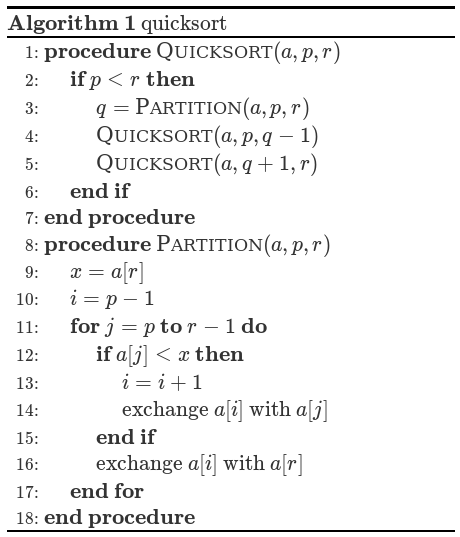

# pseudocode.js



**pseudocode.js** is a JavaScript library that typesets pseudocode beautifully to 
HTML.

* _Intuitive grammar:_ Pseudocode.js takes a LaTeX-style input that supports 
  the algorithmic constructs from LaTeX's algorithm packages. With or without 
  LaTeX experience, a user should find the grammar fairly intuitive. 
* _Print quality:_ The HTML output produced by pseudocode.js is (almost) 
  identical with the pretty algorithms printed on publications that are 
  typeset by LaTeX.
* _Math formula support:_ Inserting math formulas in pseudocode.js is as easy 
  as LaTeX. Just enclose math expression in `$...$` or `\(...\)`.

It supports all modern browsers, including Chrome, Safari, Firefox, Edge, and Edge.

Visit the [project website](https://saswatpadhi.github.io/pseudocode.js) for a demo.


## Usage

### Quick Start

pseudocode.js can render math formulas using either
[KaTeX](https://github.com/Khan/KaTeX), or [MathJax](https://www.mathjax.org/).

#### Step 1A &middot; For KaTeX users
Include the following in the `<head>` of your page:

```html
<script src="https://cdnjs.cloudflare.com/ajax/libs/KaTeX/0.16.7/katex.min.js"
        integrity="sha512-EKW5YvKU3hpyyOcN6jQnAxO/L8gts+YdYV6Yymtl8pk9YlYFtqJgihORuRoBXK8/cOIlappdU6Ms8KdK6yBCgA=="
        crossorigin="anonymous" referrerpolicy="no-referrer">
</script>
```

#### Step 1B &middot; For MathJax 2.x users
Include the following in the `<head>` of your page:

```html
<script src="https://cdn.jsdelivr.net/npm/mathjax@2.7.9/MathJax.js?config=TeX-AMS_CHTML"
        integrity="sha256-DViIOMYdwlM/axqoGDPeUyf0urLoHMN4QACBKyB58Uw="
        crossorigin="anonymous" referrerpolicy="no-referrer">
</script>
<script type="text/x-mathjax-config">
    MathJax.Hub.Config({
        tex2jax: {
            inlineMath: [['$','$'], ['\\(','\\)']],
            displayMath: [['$$','$$'], ['\\[','\\]']],
            processEscapes: true,
            processEnvironments: true,
        }
    });
</script>
```

#### Step 1C &middot; For MathJax 3.x users
Include the following in the `<head>` of your page:

```html
<script>
    MathJax = {
        tex: {
            inlineMath: [['$','$'], ['\\(','\\)']],
            displayMath: [['$$','$$'], ['\\[','\\]']],
            processEscapes: true,
            processEnvironments: true,
        }
    }
</script>
<script src="https://cdn.jsdelivr.net/npm/mathjax@3.2.2/es5/tex-chtml.js"
        integrity="sha256-Cm3tWrvOEzMWWN0jnzQ4Kr0GSSx0txth6MqoES7FX6U="
        crossorigin="anonymous" referrerpolicy="no-referrer">
</script>
```

#### Step 2 &middot; Grab pseudocode.js
Include the following in the `<head>` of your page:

```html
<link rel="stylesheet" href="https://cdn.jsdelivr.net/npm/pseudocode@latest/build/pseudocode.min.css">
<script src="https://cdn.jsdelivr.net/npm/pseudocode@latest/build/pseudocode.min.js">
</script>
```

#### Step 3 &middot; Write your pseudocode inside a `<pre>`
We assume the pseudocode to be rendered is in a `<pre>` DOM element.
Here is an example that illustrates a quicksort algorithm:

```html
<pre id="quicksort" class="pseudocode">
    % This quicksort algorithm is extracted from Chapter 7, Introduction to Algorithms (3rd edition)
    \begin{algorithm}
    \caption{Quicksort}
    \begin{algorithmic}
    \PROCEDURE{Quicksort}{$A, p, r$}
        \IF{$p < r$} 
            \STATE $q = $ \CALL{Partition}{$A, p, r$}
            \STATE \CALL{Quicksort}{$A, p, q - 1$}
            \STATE \CALL{Quicksort}{$A, q + 1, r$}
        \ENDIF
    \ENDPROCEDURE
    \PROCEDURE{Partition}{$A, p, r$}
        \STATE $x = A[r]$
        \STATE $i = p - 1$
        \FOR{$j = p$ \TO $r - 1$}
            \IF{$A[j] < x$}
                \STATE $i = i + 1$
                \STATE exchange
                $A[i]$ with $A[j]$
            \ENDIF
            \STATE exchange $A[i]$ with $A[r]$
        \ENDFOR
    \ENDPROCEDURE
    \end{algorithmic}
    \end{algorithm}
</pre>
```

#### Step 4A &middot; Render the element using pseudocode.js
Insert the following Javascript snippet at the end of your document:

```html
<script>
    pseudocode.renderElement(document.getElementById("quicksort"));
</script>
```

#### Step 4B &middot; Render all elements of the class using pseudocode.js
Insert the following Javascript snippet at the end of your document:

```html
<script>
    pseudocode.renderClass("pseudocode");
</script>
```

### Grammar
There are several packages for typesetting algorithms in LaTeX, among which 
[`algorithmic`](http://mirror.ctan.org/tex-archive/macros/latex/contrib/algorithms/algorithms.pdf)
package is the most simple and intuitive, and is chosen by IEEE in its 
[LaTeX template file](http://www.ctan.org/tex-archive/macros/latex/contrib/IEEEtran). 
The grammar of pseudocode.js is mostly compatible with `algorithmic` package with 
a few improvement to make it even more easier to use.

Commands for typesetting algorithms must be enclosed in an `algorithmic` environment:
```tex
\begin{algorithmic}
# A precondition is optional
\REQUIRE <text>
# A postcondition is optional
\ENSURE <text>
# An input is optional
\INPUT <text>
# An output is optional
\OUTPUT <text>
# The body of your code is a <block>
\STATE ...
\end{algorithmic}
```

`<block>` can include zero or more `<statement>`, `<control>`,  `<comment>` 
and `<function>`:
```tex
# A <statement> can be:
\STATE <text>
\RETURN <text>
\PRINT <text>

# A <control> can be:
# A conditional
\IF{<condition>}
    <block>
\ELIF{<condition>}
    <block>
\ELSE
    <block>
\ENDIF
# Or a loop: \WHILE, \FOR or \FORALL
\WHILE{<condition>}
    <block>
\ENDWHILE
# Or a repeat: \REPEAT <block> \UNTIL{<cond>}
\REPEAT
    <block>
\UNTIL{<cond>}

# A <function> can by defined by either \FUNCTION or \PROCEDURE
# Both are exactly the same
\FUNCTION{<name>}{<params>}
    <block> 
\ENDFUNCTION

# A <comment> is:
\COMMENT{<text>}
```

A `<text>`, `<block>`, or `<condition>` may include the following:
```tex
% Normal characters
Hello world
% Escaped characters
\\, \{, \}, \$, \&, \#, \% and \_
% Math formula
$i \gets i + 1$
% Function call
\CALL{<func>}{<args>}
% Keywords
\AND, \OR, \XOR, \NOT, \TO, \DOWNTO, \TRUE, \FALSE, \BREAK, \CONTINUE
% LaTeX's sizing commands
\tiny, \scriptsize, \footnotesize, \small \normalsize, \large, \Large, \LARGE, 
\huge, \HUGE
% LaTeX's font declarations
\rmfamily, \sffamily, \ttfamily
\upshape, \itshape, \slshape, \scshape
\bfseries, \mdseries, \lfseries
% LaTeX's font commands
\textnormal{<text>}, \textrm{<text>}, \textsf{<text>}, \texttt{<text>}
\textup{<text>}, \textit{<text>}, \textsl{<text>}, \textsc{<text>}
\uppercase{<text>}, \lowercase{<text>}
\textbf, \textmd, \textlf
% And it's possible to group text with braces
normal text {\small the size gets smaller} back to normal again
```

> **Note**
> Although pseudocode.js recognizes some LaTeX commands, it is by no means a full-featured LaTeX implementation in JavaScript.
> It only support a subset of LaTeX commands that are most relevant to typesetting algorithms.


To display the caption of an algorithm, use `algorithm` environment as a 'float' wrapper :
```tex
\begin{algorithm}
\caption{The caption of your algorithm}
\begin{algorithmic}
\STATE ...
\end{algorithmic}
\end{algorithm}
```

### Options

#### Global Options

`pseudocode.renderElement` can accept an option object as the last argument, such as

```js
pseudocode.renderElement(document.getElementById("quicksort"),
                         { lineNumber: true });
```

The following options are currently supported:

 * `indentSize`: The indent size of inside a control block, e.g. if, for,
        etc. The unit must be in 'em'.
 * `commentDelimiter`: The delimiters used to start and end a comment region.
        Note that only line comments are supported.
 * `lineNumber`: Whether line numbering is enabled.
 * `lineNumberPunc`: The punctuation that follows line number.
 * `noEnd`: Whether block ending, like `end if`, end procedure`, etc., are
        showned.
 * `captionCount`: Reset the caption counter to this number.

The default values of these options are:

```js
var DEFAULT_OPTIONS = {
    indentSize: '1.2em',
    commentDelimiter: '//',
    lineNumber: false,
    lineNumberPunc: ':',
    noEnd: false,
    captionCount: undefined
};
```

#### Per-Element Options

The above-mentioned global options may be overridden on a per-element basis
using [HTML `data-*` attributes](https://developer.mozilla.org/en-US/docs/Web/API/HTMLElement/dataset)
on the `<pre>` DOM element.

The following example demonstrates how to enable line numbers and change title prefix:

```html
<pre id="quicksort" class="pseudocode"
     data-line-number=true data-title-prefix="Algo">
   ...
</pre>
```

## Build and Test
pseudocode.js is written in JavaScript and built with [Node.js](https://nodejs.org).
So, make sure you have Node.js installed before building pseudocode.js.

To compile the project on Ubuntu Linux, run the following commands in terminal:

```bash
cd pseudocode.js/
npm install
make
```

Then, open one of the sample documents:
- `build/katex-samples.html`, or
- `build/mathjax-v2-samples.html`, or
- `build/mathjax-v3-samples.html`
in your favorite browser to check if the algorithms are typeset correctly.


## Author
pseudocode.js was originally written by Tate Tian ([@tatetian](https://github.com/tatetian)).
Together with [@ZJUGuoShuai](https://github.com/ZJUGuoShuai),
I ([@SaswatPadhi](https://github.com/SaswatPadhi)) added the MathJax support,
and I am the current maintainer of this project.
Suggestions, bug reports and pull requests are most welcome.

## Acknowledgement
pseudocode.js is partially inspired by [KaTeX](http://khan.github.io/KaTeX/).
Thanks Emily Eisenberg([@xymostech](https://github.com/xymostech))
and other contributors for building such a wonderful project.
